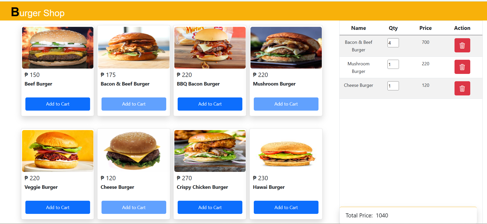

# Burger POS

## Overview 📌
A simple POS website lets customers browse a burger menu, add items to their cart, adjust quantities, and see real-time updates of the total order. It also allows removing items and viewing selected products. The system provides a smooth, user-friendly experience to efficiently manage orders and track totals instantly.

## Features 📌
- Add items to cart
- Adjust item quantities
- Real-time order total updates
- Remove items from cart
- View selected products

## Tech Stack 📌
- **Frontend**: HTML, CSS, Bootstrap, JavaScript (DOM manipulation)